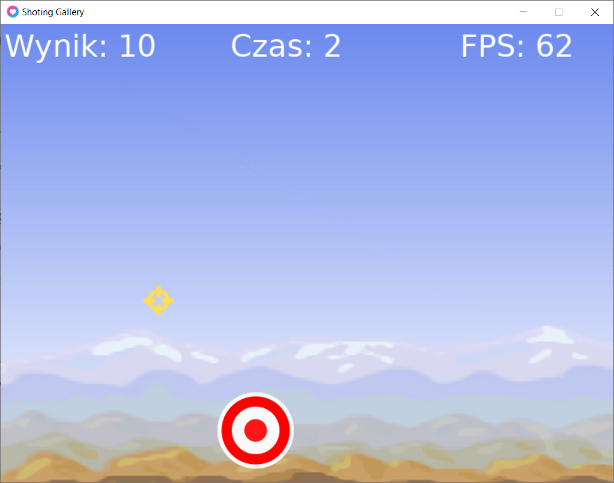
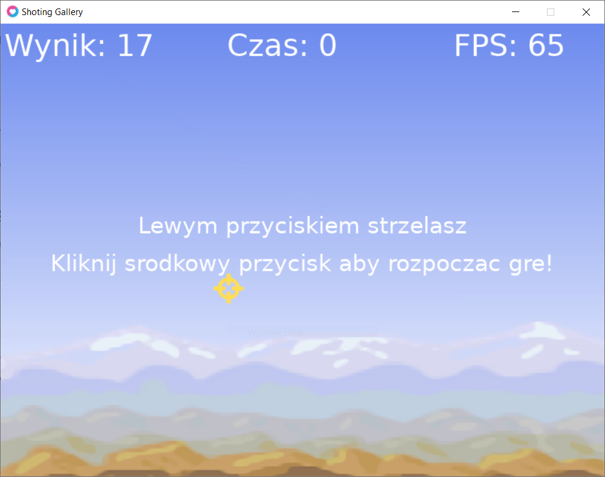

# Love2D_ShootingGallery
 First game used LÖVE framwork. Simple Point & Shoot game. Created with LÖVE 11.3. This project based on Udemy course: https://www.udemy.com/course/lua-love/, section: "Game #1: Shooting Gallery".
 
 ## Screenshots
 
 ### 1. During game:
 

 ### 2. Menu/Game Over:
 